<picture>
  <source media="(prefers-color-scheme: dark)" srcset="dark.svg">
  <source media="(prefers-color-scheme: light)" srcset="light.svg">
  
</picture>

  <a href="https://shinex.dev">shinex.dev</a>
  &nbsp;·&nbsp;
  <a href="https://t.me/shinex">Telegram</a>

